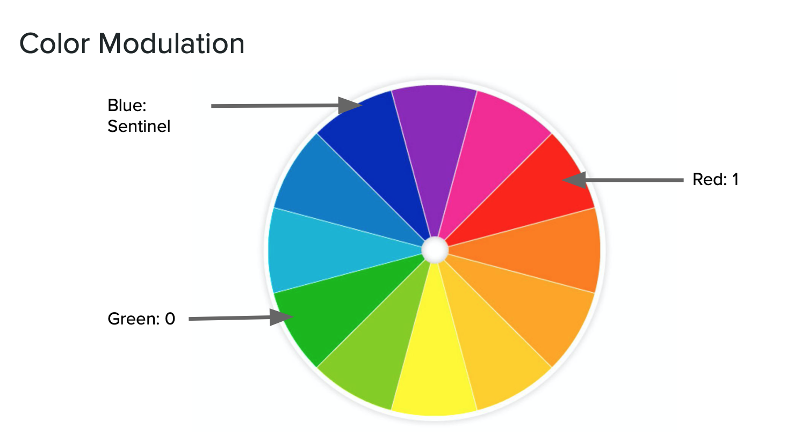
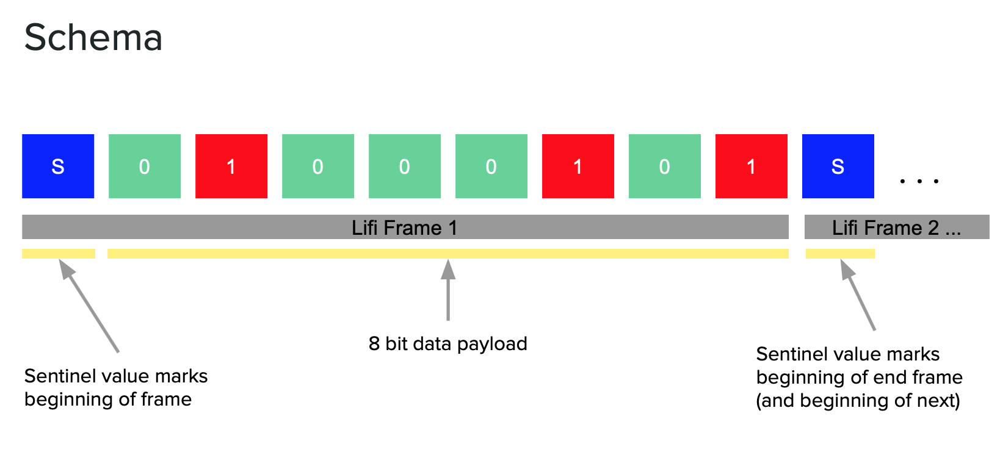

# LiFi

The moonshot of moonshots. Let's see if we can get this to work...
If this works we'll actually have a pretty frickin cool project.

## Overview
This repo consists of two main components - transmission (tx) and reception
(rx). The transmission code is written in a modular fashion to allow tx through
different mediums. The primary mediums being developed are a computer screen
(such as a dev laptop) and a Unicorn LED PiHat (prod). Transmission from on the
computer screen uses PyQt5 to display a blinking color signal as a rectangle to
the user.

The rx part in this repo was developed as a rough prototype in
python using OpenCV. A C++ version written in OpenCV and capable of running on
an iPhone can be found in the [frontend-ar repo][ar-repo].

## Color Modulation and Schema

This lifi implementation uses color modulation to transmit data over an RGB
light source. 

In this implementation we use 3 colors. Blue represents a sentinel value that
indicates the beginning and/or end of a data frame. Green represents the value
0 and red represents the value 1. Colors are streamed sequentially in the
following schema. 

## Decoding 
Detection works as follows. 
- Define color hsv color ranges for each color expected to be found
- Apply gaussian blur to image
- Convert from BGR to HSV
- For each color:
  - Find pixels in range of color
  - Find contours
  - Approximate shape of contours -> Filter contours on the desired shape
  - Find the largest contour
- Take largest target -> Find nearest target previously seen
- If the target is close enough, 
  - targets are the same -> add to the history of the target, mark we've seen it
  - if the history forms a complete frame, trigger notification of the completed
  frame
- Else
  - this is a new target. start tracking the history
- Remove any target that we haven't seen in a while from the tracked history

## Transmistter Setup
When running on the Raspberry Pi, the following setup was used. The paper towel
diffuser is important to turn the light into single shaped target. 

## Setup
(Preferably in a venv, using Python3.6.5) 
`pip install -r requirements`

There may be some other requirements for getting QT5 working on your machine...

## Running

### PyQt5 Laptop Tx
`python scripts/run_pyqt_tx.py`

### Unicorn PiHat Tx
`sudo python3 scripts/run_tx.py`

### Receiving (Prototype)
For the time being, this prototype is being developed on recorded videos.
1. Capture a video on the iPhone in Slow-Mo (240 fps)
2. Edit video so entire video is in Slow-Mo or none of video is in Slow-Mo
    - Find video on phone
    - Click "Edit" button
    - At the very bottom there should be a slider thingy with ticks denoting
    where the video is being played in Slow-Mo vs normal speed
    - Make it all one or the other. 
3. Upload video to your computer
4. `python scripts/run_rx.py -v <path to video>`

[ar-repo]: https://github.com/capstone-winners/frontend_ar/tree/master/cap/LifiDetector
